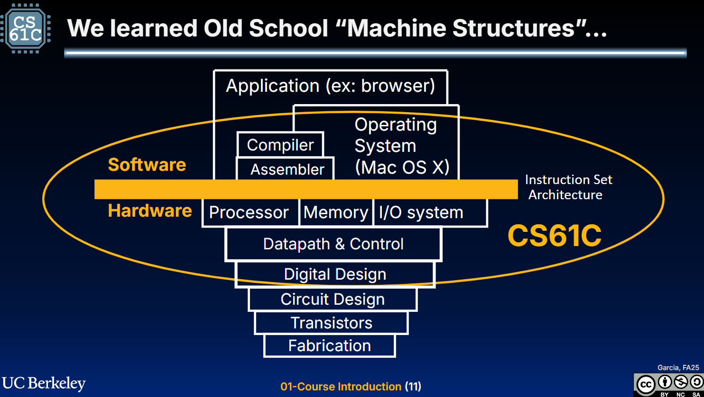
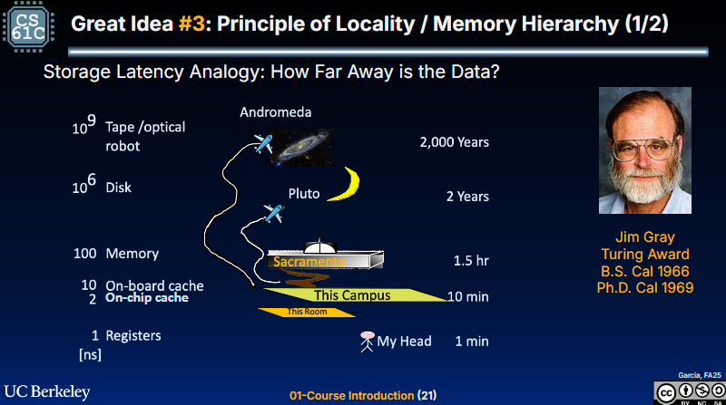
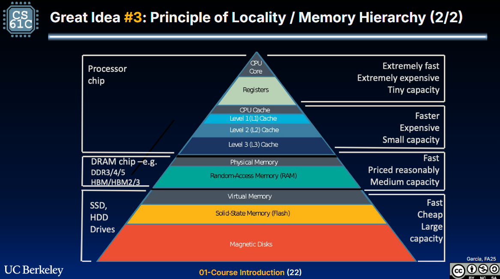
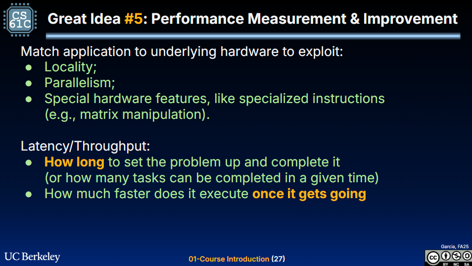

# 计算机体系结构 Great Idea in Computer Architecture

## Lecture 1: Intro
没什么特别的，就是对当前计算机的体系结构方面进行了一个科普

比较有用的内容是这几张图：

- 以ISA为分界线，把计算机结构分为软硬件两个部分；我们使用的高级语言要经过编译器转换为汇编语言（或机器码），而汇编器将汇编语言转换为机器码。
- 在处理器、内存、IO下，隐含着数据路径（ALU、寄存器）与控制单元，再往下是数字设计（与或非门等数字电路实现）和电路设计（逻辑门的物理实现），晶体管和制造

离cpu越近的，比如寄存器，存储时延仅需1纳秒，就好像人在自己房间拿了个东西；而硬盘则在毫秒级别，就像人类去了冥王星？

主要是物理内存和虚拟内存的区别，别搞混。

- 局部性原理、并行、特殊的硬件功能（专用硬件，随着摩尔定律的失效，可以说通用计算单元的发展已经一定程度上停滞了，因此出现了许多为特定任务设计的专用硬件）
- 性能的衡量：时延——一个任务从开始到结束需要多少时间；吞吐量——在给定的时间里可以完成多少个任务。

## Lecture 2: Number Representation
没什么特别的，就是2、8、16进制之间的转换。